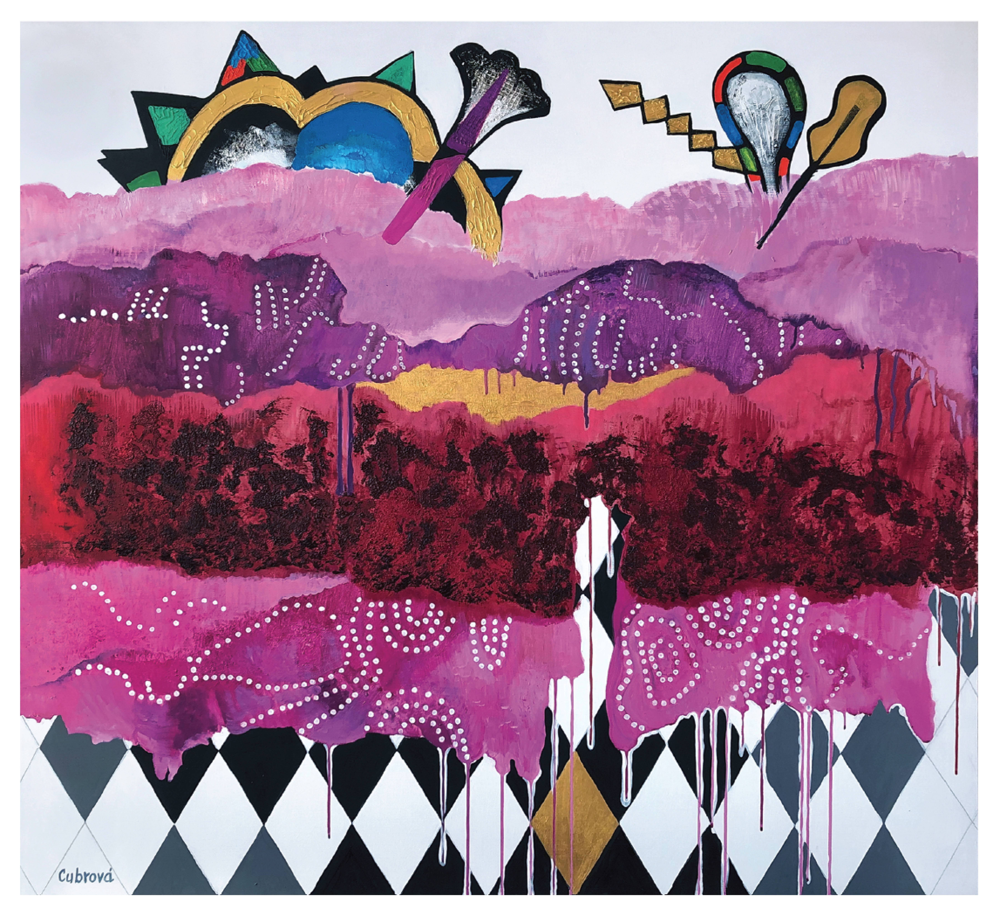

# Magdalena Cubrova

学术艺术家 Magdalena Cubrova – 绘画、装置、图形艺术。

Magdalena Cubrova 曾就读于捷克美术学院，从那时起，她成为一名专业的平面艺术家已有 50 多年。她的工作和时间安排非常有条理，每天都在坚持不懈地工作。她在世界各地都有展览和装置。此外，她从事室内设计工作，在她职业生涯的初期，她主要从事平面艺术家的工作。

Magdalena Cubrova 1952 年出生于捷克斯洛伐克（现捷克共和国）布拉格。她曾就读于布拉格美术学院，并于 1976 年以 A. Fisarek 和 J. Smetana 教授的学生身份毕业。完成学业后，她开始了职业艺术家、油画和纪念性创作的职业生涯。1982 年，她获得了意大利佩鲁贾彼得罗瓦努奇学院的奖学金。

目前，她在超过52个集体展览、23个国际展览（捷克共和国、意大利、荷兰和德国）以及28个个人展览中展示了她的艺术。她创作了25个建筑项目，近1000幅油画，数百幅素描和插图。她的作品在布拉格的国家美术馆、捷克共和国的地区画廊、政府办公室、企业和世界各地的私人收藏中展出（捷克共和国、德国、意大利、瑞典、美国、巴西、日本、希腊、荷兰、英国、瑞士、委内瑞拉和西班牙）。

