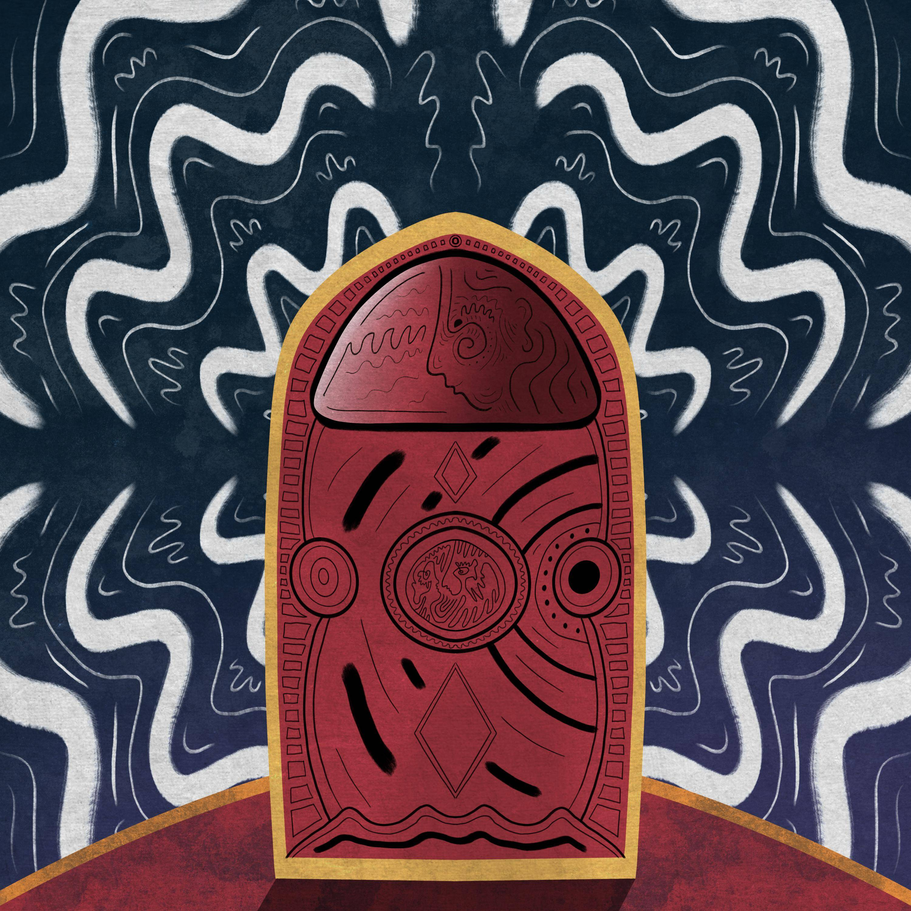

# Magic Mind NFT

Magic Mind 是艺术家 Kira Bursky 的 NFT 系列，旨在庆祝心理健康和自我保健。

有 10,000 件独特的艺术作品，由 1,000 多幅手绘艺术品制成。每件作品都具有情感和心理意义。当你看艺术的时候，你看到了什么？你感觉怎么样？

Magic Mind 由一个以心为中心的团队创建，该团队热衷于将心理健康意识和支持带入 NFT 社区及其他社区。

你准备好和我们一起探索魔法了吗？

每一张 Magic Mind NFT 都是一幅潜意识的画像，层层叠叠的心理和情感意义。

就像人类灵魂的微妙之处一样，每一件作品都是独一无二的，有层次的，偶尔也会出人意料。每个 Magic Mind NFT 都包含一个 Mind Space、隐喻模式和其他心理元素。

一些 Magic Mind NFT 比其他的更罕见。更罕见的特征包括能量束、梯子和其他神秘的惊喜。NFT 的一小部分选择是潜意识场景：梦幻山脉、漂浮的眼睛、棱柱形瀑布、神秘的门口等等。

