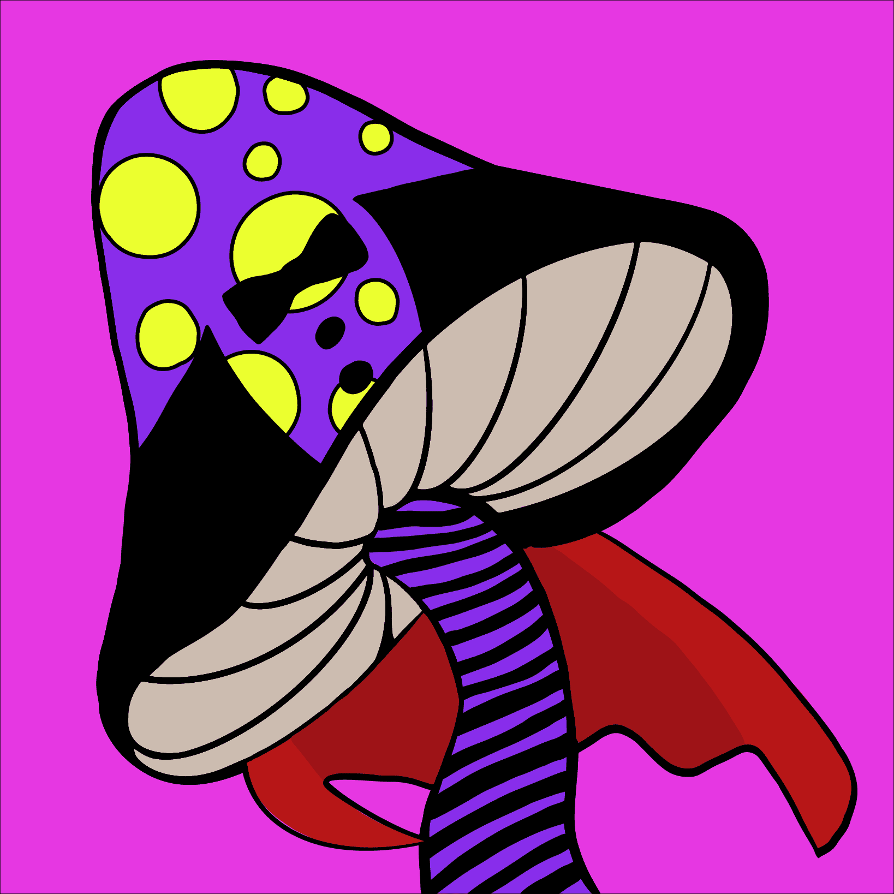

# Magic Mushrooms Official

1200 个随机生成的蘑菇的集合。为什么是蘑菇？- 就是那个问题。看看 Terrence McKenna 的 Stoned Ape 假说就知道了。该理论假设迷幻蘑菇在早期人类的意识、发展和文化中发挥着至关重要的作用。麦肯纳甚至得出结论，语言作为一个整体，可以追溯到蘑菇。作为人类意识的第一个范式。

Magic Mushrooms 是托管在以太坊区块链上的 1200 个随机生成的 NFT 的集合。每个蘑菇都有几个不同稀有性和特征的特征。虽然每种蘑菇都独一无二，但有些蘑菇可能比其他蘑菇更可爱。

