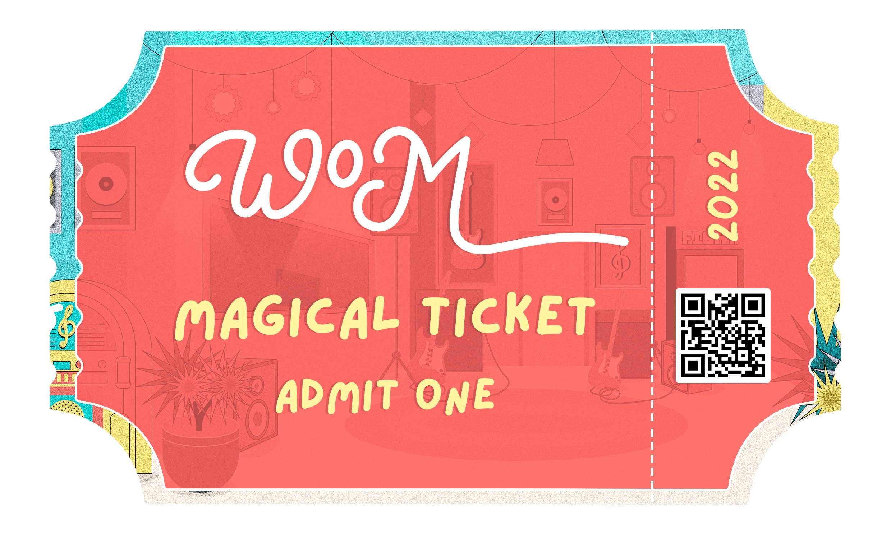

# Magical Ticket

欢迎来到音乐 世界 World of Music 是一家现代音乐科技公司，它使用 NFT 为持有者提供获得终极音乐体验的机会，以对音乐业务未来的战略思维来创造软件和体验。 该团队于 2022 年首次推出 WOM，作为一个平台和社区，以支持世界各地的独立艺术家、经理、唱片公司和#musicaddicts。 WOM 旨在消除粉丝、艺术家和我们都喜爱的音乐之间存在的障碍。加入我们的后台，重新定义音乐体验。

MusicCares 帮助音乐背后的人类，因为音乐为世界带来了如此多的东西。提供预防、紧急和恢复计划，MusiCares 是一个支持音乐界健康和福利的安全网。MusicCares 于 1989 年由 Recording Academy 创立，是一家总部位于美国的 501 慈善机构，通过直接的财政资助计划、支持资源网络和量身定制的危机救济工作来保障所有音乐人的福祉。

