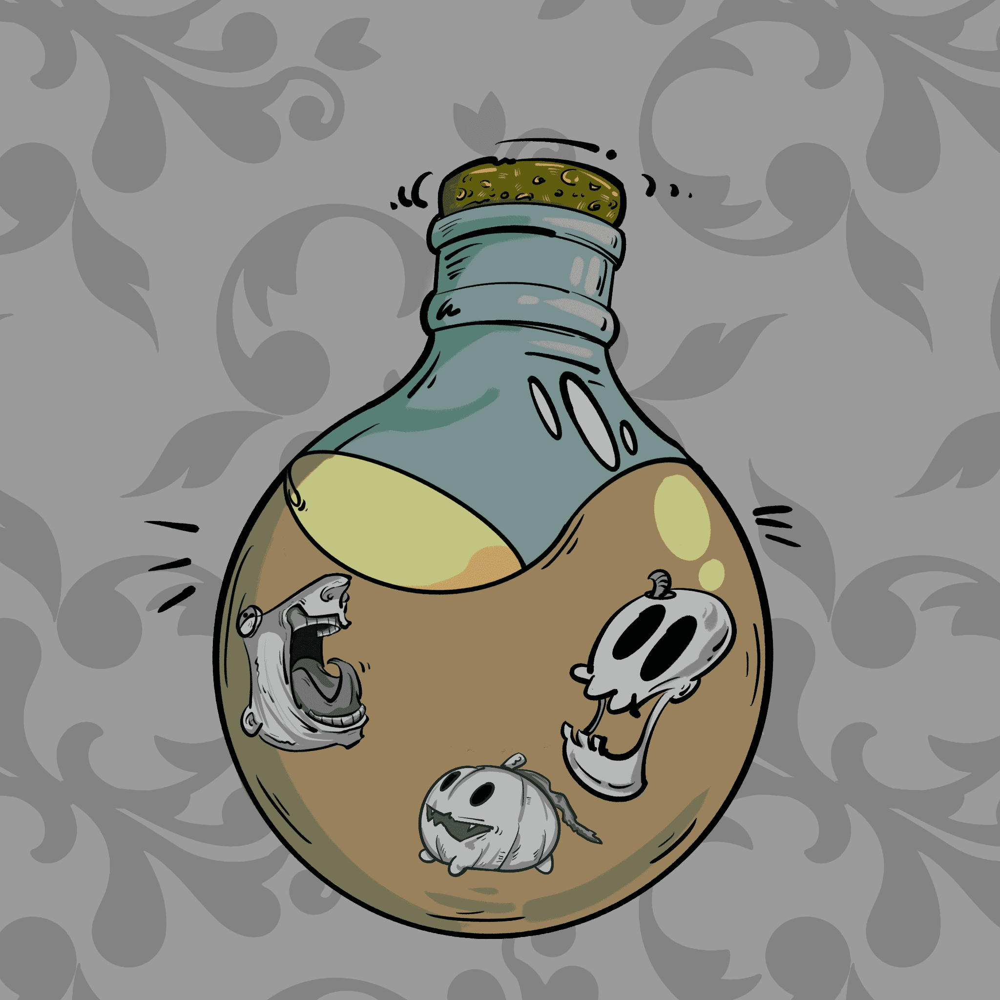

# MagicBottle V2

过去 7 天内没有售出 MagicBottle V2。

每个魔瓶里都有一个来自另一个世界的怪物。

▶ 什么是 MagicBottle V2？
MagicBottle V2 是一个 NFT（非同质代币）集合。存储在区块链上的数字艺术品集合。
▶ 有多少 MagicBottle V2 代币？
总共有 79 个 MagicBottle V2 NFT。目前，42 位所有者的钱包中至少有一个 MagicBottle V2 NTF。
▶ 最昂贵的 MagicBottle V2 销售是什么？
售出的最昂贵的 MagicBottle V2 NFT 是 . 它于 2022 年 6 月 23 日（2 个月前）以 34 美元的价格售出。
▶ 最近卖出了多少台MagicBottle V2？
过去 30 天内售出了 3 个 MagicBottle V2 NFT。

