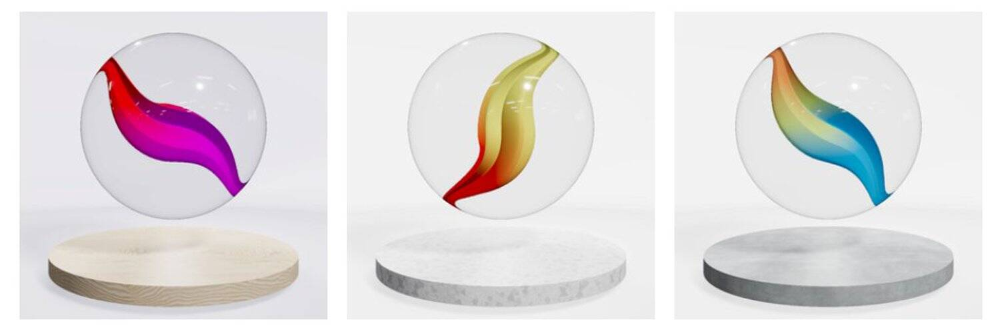

# MagicMarbles

Magic Marbles 是 8,888 件独特的 3D 艺术作品的集合，以编程方式生成并存储在以太坊区块链上。
您的 Magic Marble NFT 将作为获得独家权益的访问卡。
Hodlers 将有资格获得奖励、未来的掉落和社区活动。

每个 MagicMarble NFT 都是在铸币时以编程方式生成的。
复杂的算法仔细挑选了塑造每个 Magic Marble NFT 个性的鲜艳颜色和渐变。

1st - 入门级。铸造4,444 颗大理石。大理石类型：猫眼。
2nd -由 1 级弹珠创建的2,222 颗弹珠的时尚设计。大理石类型：TBA
3rd - 1,111颗美丽的大理石，由 2 级大理石制成。大理石类型：TBA
4th - 令人惊叹的777大理石作为 3 级大理石的组合。大理石类型：TBA
5th - 我们最稀有的大理石！只能创建其中的334个。大理石类型：待定

