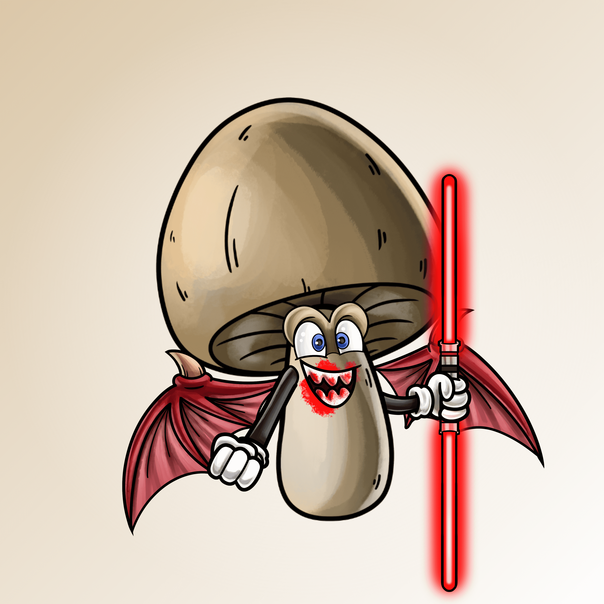

# Magic Mushroom Mafia

Magic Mushroom Mafia 是 1,129 个 Magic Mushroom NFT 的集合——生活在以太坊区块链上的独特数字收藏品。

持有者每持有一个Magic Mushroom Mafia NFT，将获得1辆NFT - Magic Mushroom Mafia Transportation

持有者还可以根据持有的 MMM NFT 数量获得其他 NFT 空投 - 有关实用程序的更多信息，请参阅我们的 Discord

请注意网络钓鱼诈骗。

▶ 什么是魔法蘑菇黑手党？
Magic Mushroom Mafia 是一个 NFT（Non-fungible token）集合。存储在区块链上的数字艺术品集合。
▶ 魔菇黑手党代币有多少？
总共有 1,122 个 Magic Mushroom Mafia NFT。目前，464 位所有者的钱包中至少有一个 Magic Mushroom Mafia NTF。
▶ 最近卖出了多少魔菇黑手党？
过去 30 天内共售出 0 个 Magic Mushroom Mafia NFT。

