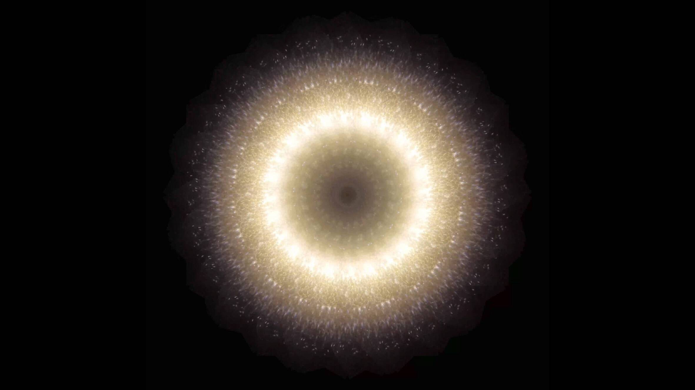

# Magic Sources

AURORA 的“魔源”。在本系列的影像作品中，AURORA 以真实的光线为素材。她通过自己投入的物理方式制造光线，操纵光线并将其拍摄下来。然后视频被数字化编辑成视频艺术。实际光线的闪烁和随机运动给观众一种平静的感觉。光是创造之源，也是带给我们进化的魔法。这是我们每个人内在的东西。在 MakersPlace 上查找更多与该系列相关的艺术品。视觉艺术家，当代艺术家。混合媒体、装置、视频艺术、NFT。

