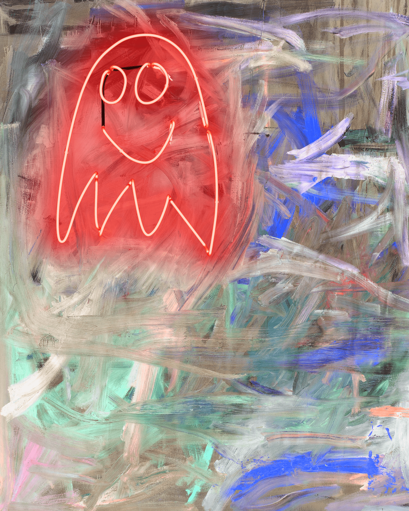

# Magnum NFT

Thrush Holmes 是一位加拿大画家，他以一种激进的、毫无歉意的当代方式探索传统艺术主题，将诗意的比喻与朋克的情感进行对比。探索他从工作室作品中创建的 999 个 NFT 集合。所有作品均来自画眉工作室的物理元素。

在我的作品中加入霓虹灯已经成为一种标志性的风格。这是我多年创作的画作的标点符号。玻璃是手工吹制的，并在精心挑选的粉末涂层彩色管中注入不同的气体，以创造出各种发光的颜色。然后精心记录这些内容，为 MAGNUM 创建元素。

