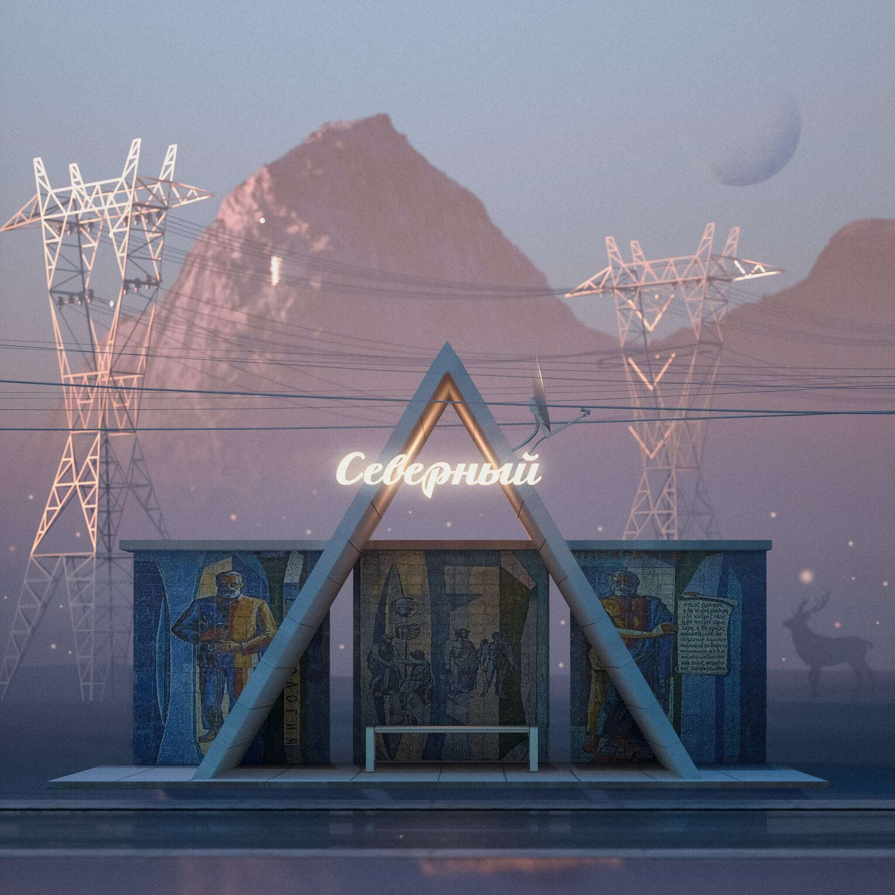

# Marina Gayrati photography

怀旧明信片合集，穿越时空。

过去 7 天没有售出 Marina Gayrati 摄影作品。

▶ 什么是 Marina Gayrati 摄影？
Marina Gayrati 摄影是一个 NFT（不可替代令牌）集合。存储在区块链上的数字艺术品集合。
▶ 有多少 Marina Gayrati 摄影代币？
总共有 1 个 Marina Gayrati 摄影 NFT。目前，17 位业主的钱包中至少有一个 Marina Gayrati 摄影 NTF。
▶ 最昂贵的 Marina Gayrati 摄影拍卖会是什么？
出售的最昂贵的 Marina Gayrati 摄影 NFT 是 Undine。它于 2022-06-10（3 个月前）以 34.5 美元的价格售出。
▶ 最近卖出了多少 Marina Gayrati 摄影作品？
过去 30 天内售出了 3 个 Marina Gayrati 摄影 NFT。

