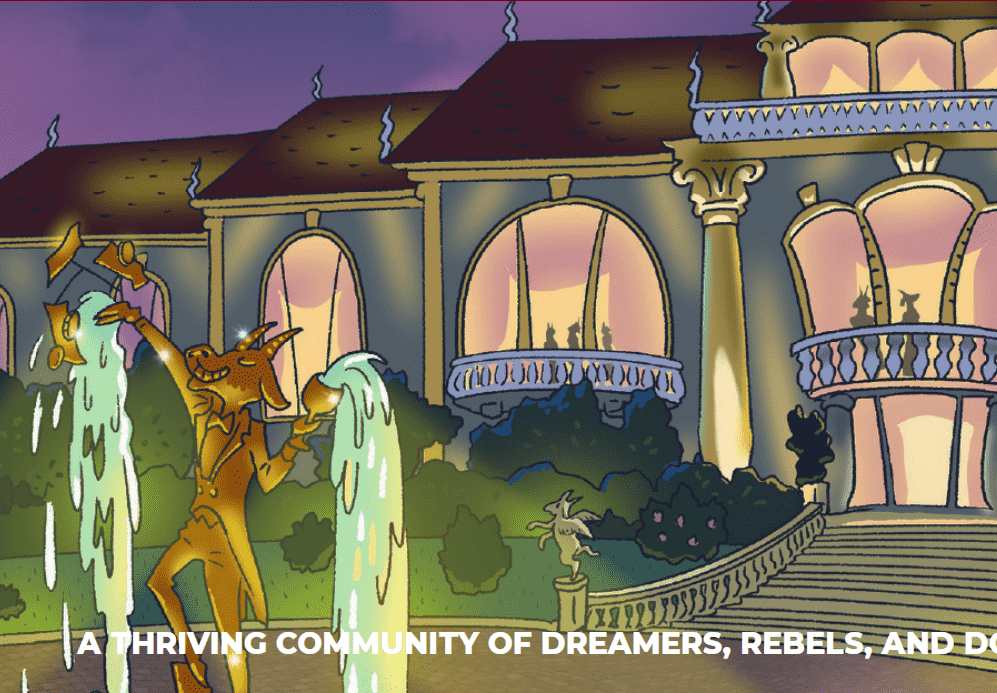

# GOATz

GOATz 是有史以来第一个通货紧缩的 PFP NFT，它使所有者能够通过称为 The Forge 的过程自定义他们的 NFT。GOATz 的总供应量总是在减少，而艺术总是在增强。它们是 ERC-721 代币，存在于以太坊区块链上。拥有一只 GOAT 不仅仅是拥有一个个性化的头像，还在于获得一个充满活力、成功和慷慨的社区

GOATz 于 2021 年 7 月推出，是有史以来第一个通货紧缩的 PFP NFT，它使所有者能够通过名为 The Forge 的流程自定义其 NFTS。GOATz 的稀缺性一直在增加，而艺术也在不断提高。拥有一只 GOAT 将打开通往令人惊叹的社区的大门，以及我们在沙盒和 NFT 世界等不同的虚拟世界中专门为 GOATz 开发的一切。

