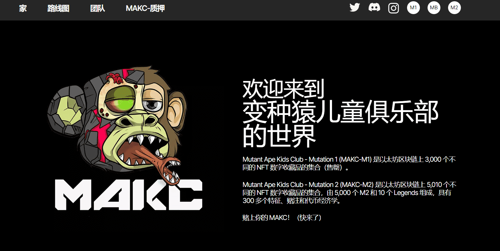

# MAKC-M1

Mutant Ape Kids Club - Mutation 1 (MAKC-M1) 是以太坊区块链上 3,000 个不同的 NFT 数字收藏品的集合。

2021 年，一颗小行星撞上了孩子们的猿猴附近。人们看到突变的猿猴从陨石坑里爬出来，表现得古怪而奇特。

有来自孩子猿附近的谣言，预计另一颗小行星将在不久的将来造成更大的干扰。

Mutant Ape Kids Club - Mutation 1 (MAKC-M1) 是以太坊区块链上 3,000 个不同的 NFT 数字收藏品的集合（售罄）。

Mutant Ape Kids Club - Mutation 2 (MAKC-M2) 是以太坊区块链上 5,010 个不同的 NFT 数字收藏品的集合，由 5,000 个 M2 和 10 个 Legends 组成，具有 300 多个特征、赌注和代币经济学。

