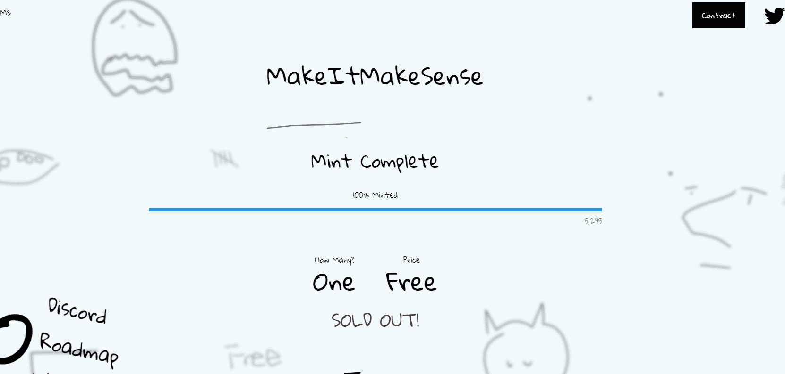

# MakeItMakeSense

没有任何意义 - 5,000 幅手绘 1/1 JPEG，没有实用程序，没有不和谐，没有路线图，没有计划。但无论如何你都不在乎这些，你……你能模仿吗？

什么是 MakeItMakeSense？

MakeItMakeSense 是一个 NFT（不可替代令牌）集合。存储在区块链上的数字艺术品集合。

存在多少 MakeItMakeSense 代币？

总共有 5,295 个 MakeItMakeSense NFT。目前，2,652 名所有者的钱包中至少有一个 MakeItMakeSense NTF。

MakeItMakeSense 最昂贵的销售是什么？

最昂贵的 MakeItMakeSense NFT 是 [MIMS #880](https://www.nft-stats.com/asset/0x2183533bbc58c9afef81bd4165bafd9f7654ed16/880)。它于 2022-06-06（3 个月前）以 90.7 美元的价格售出。

最近卖出了多少 MakeItMakeSense？

过去 30 天内共售出 1,146 个 MakeItMakeSense NFT。

MakeItMakeSense 需要多少钱？

在过去 30 天里，MakeItMakeSense NFT 最便宜的销售额低于 7 美元，最高销售额超过 18 美元。MakeItMakeSense NFT 在过去 30 天内的中位价格为 13 美元。

