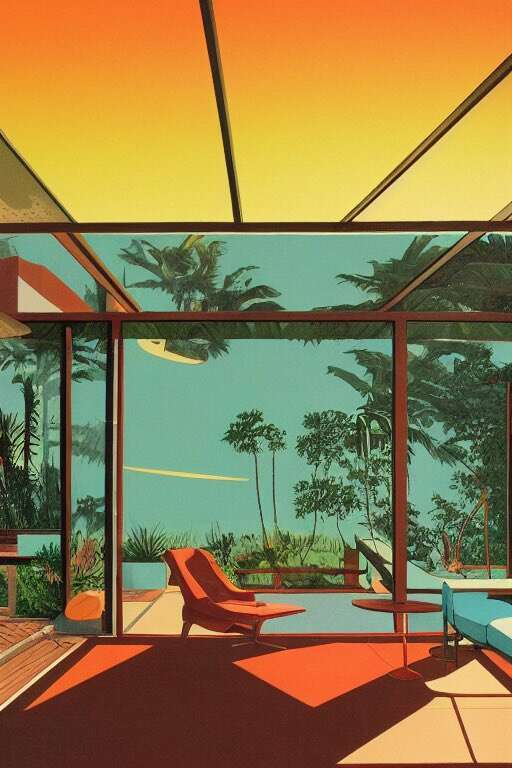

# makeitrad - interiors

“Interiors”是一个独特的 1/1 集合，探索梦幻般的空间，呈现在过去、现在和未来。一瞥从未体验过的生活方式。“Interiors”探讨了未来的发展，以及未来的发展如何与过去的演变有着内在的联系。

人类互动与人工智能之间的实验艺术系列。

Makeitrad 是洛杉矶的一名设计师和像素操纵者，他的工作旨在探索如何在被困在技术世界中的同时发现自然的有机之美。他经常使用人工智能和机器学习，但也接受随机性和噪音的想法来驱动最终形式。凭借他通过孩子的镜头寻找灵感的不可思议的能力，其结果是富有洞察力和鼓舞人心的艺术品，同时也充满活力、天真和有趣。

