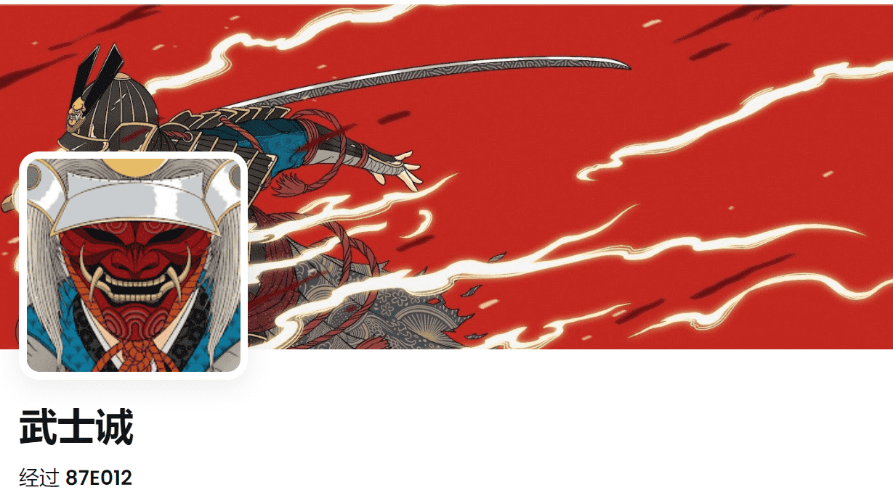

# Makoto Samurais

MAKOTO系列由 3,333 个算法生成的正面武士组成，超过 100 个手绘特征为他们的氏族生存而战。

什么是诚武士？

Makoto Samurais 是一个 NFT（不可替代令牌）集合。存储在区块链上的数字艺术品集合。

存在多少 Makoto Samurais 代币？

总共有 3,326 个 Makoto Samurais NFT。目前，1,080 位车主的钱包中至少有一个 Makoto Samurais NTF。

最昂贵的 Makoto Samurais 销售是什么？

售出的最昂贵的 Makoto Samurais NFT 是 [Makoto Samurai #1839]。它于 2022-06-04（3 个月前）以 7.1 美元的价格售出。

最近卖出了多少诚武士？

过去 30 天内共售出 9 个 Makoto Samurais NFT。

