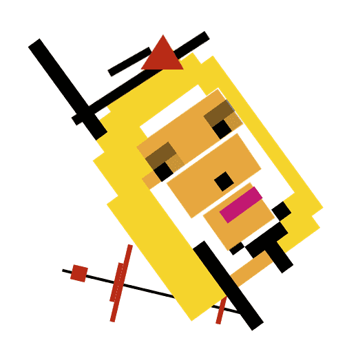

# MalevichPunks NFT

MalevichPunks 融合了数字艺术和俄罗斯天才艺术家 Kazimir Malevich 的作品，他生活在 100 年前并定义了抽象艺术的样子。这个 NFT 系列是对 Kazimir Malevich 的致敬，并试图让他的名字和遗产更容易被识别。

该项目向原始的 CryptoPunks 致敬，不隶属于 Larva Labs。没有使用原始图像，MAPU 是通过算法从头开始绘制的。

当艺术遇到金钱时，马列维奇朋克就会发生。艺术与金钱的界限在哪里？多亏了 NFT，它变得越来越模糊，允许革命性的合并。构图、颜色、角度、形状、抽象成为围绕数字的填充物，成为永恒不变的一部分。这个 NFT 系列是对Kazimir Malevich的致敬， 并试图让他的名字和遗产更容易被识别。

