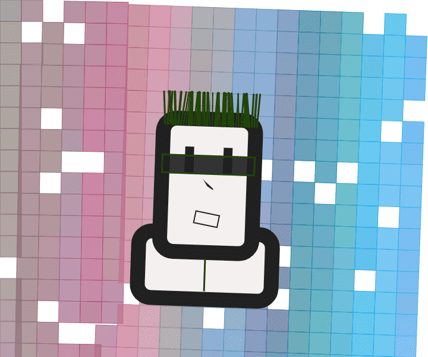

# Mallows BYOA

Mallows 是“byoa”的艺术收藏——带上你自己的算法。每个 Mallow 都带有独特的生成艺术以及存储在 ipfs 上的不可变元数据中的 byoa 算法。您的 byoa 算法允许您在 byoa-sdk 兼容页面上使用功能。mallows.xyz 正在通过“byoa”在 NFT 领域进行开创性创新。谁是锦葵？他们是可爱的、书呆子的、热爱科技的棉花糖，生活在锦葵诗中！每个人都有有趣的特点，从编程语言到配件，再到他们的技术氛围。看看锦葵诗！

Mallows 是第一个让您通过（自带算法）访问 web3 应用程序和元界的 NFT。

