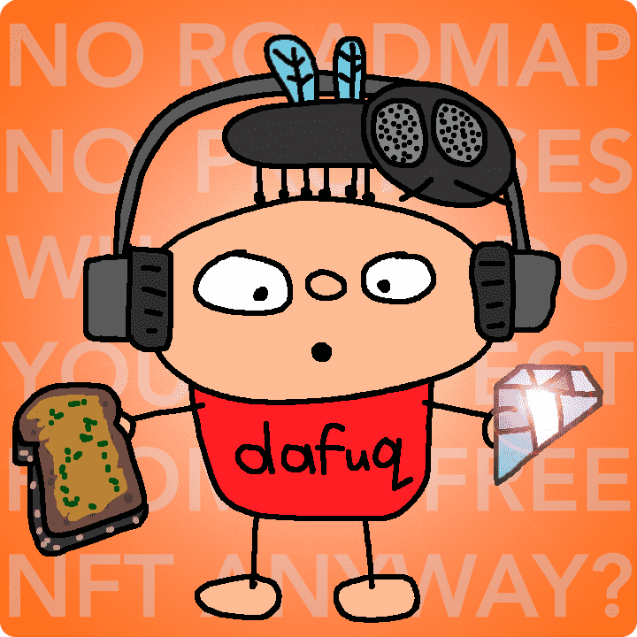

# MAMF Orange

这是我的 pfp 项目 MAMF（我和我的朋友）的免费薄荷衍生系列。因为艺术不应该有进入的经济障碍。由艺术家马克·利亚姆·史密斯创作。

▶ 什么是 MAMF 橙？
MAMF Orange 是一个 NFT（非同质代币）集合。存储在区块链上的数字艺术品集合。
▶ 存在多少 MAMF Orange 代币？
总共有 10,000 个 MAMF Orange NFT。目前，618 位车主的钱包中至少有一个 MAMF Orange NTF。
▶ 什么是最昂贵的 MAMF Orange 销售？
售出的最昂贵的 MAMF Orange NFT 是 MAMF Orange #4468。它于 2022-06-08（3 个月前）以 10 美元的价格售出。
▶ 最近卖出了多少MAMF Orange？
过去 30 天内售出了 44 个 MAMF Orange NFT。
▶ 一个 MAMF Orange 的价格是多少？
过去 30 天，最便宜的 MAMF Orange NFT 销售额低于 5 美元，最高销售额超过 9 美元。过去 30 天，MAMF Orange NFT 的中位价格为 5 美元。

