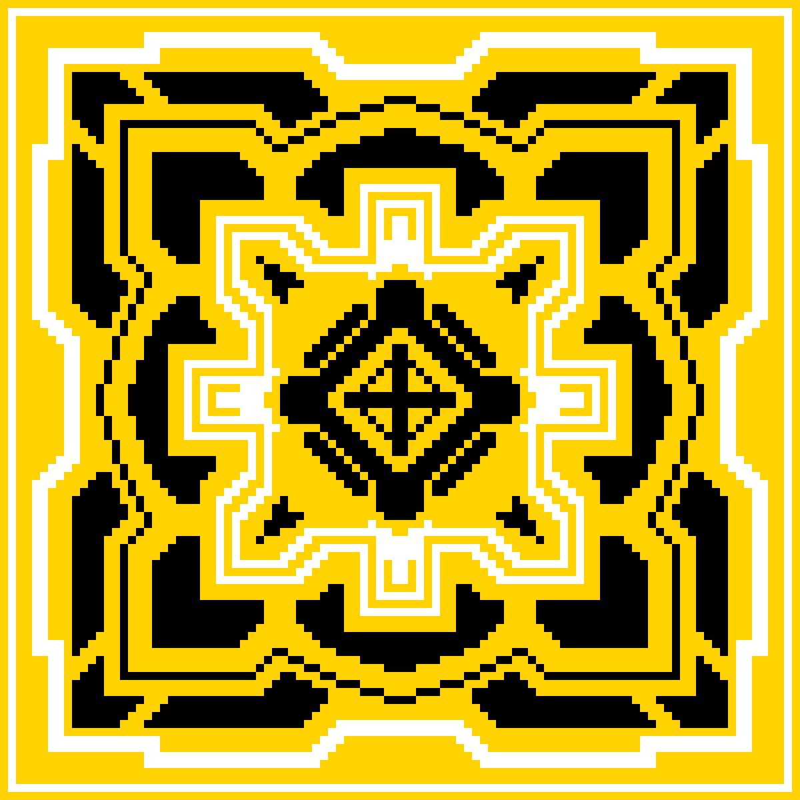

# Mandala Blocks

一个冥想的像素艺术实验。一个有限的精神标点符号。焦点错位的产物。请享受。限量供应 300 个，带有 50 个最低限度的动画代币。Art 是用 buenonft 制作的，并在 RealLaunchMyNFT 上发布。

▶ 什么是曼陀罗块？
Mandala Blocks 是一个 NFT（不可替代代币）集合。存储在区块链上的数字艺术品集合。
▶ 存在多少个 Mandala Blocks 代币？
总共有 300 个 Mandala Blocks NFT。目前，28 位所有者的钱包中至少有一个 Mandala Blocks NTF。
▶ 最昂贵的 Mandala Blocks 销售是什么？
出售的最昂贵的 Mandala Blocks NFT 是 Mandala Block #104。它于 2022-06-19（3 个月前）以 5 美元的价格售出。
▶ 最近卖出了多少曼陀罗积木？
过去 30 天内售出了 1 个 Mandala Blocks NFT。

