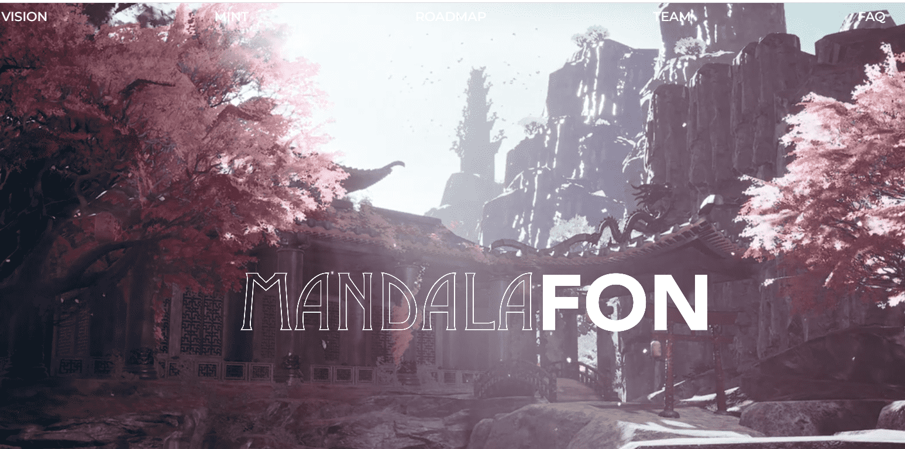

# MandalaFON

MANDALAFON 是 1,011 个化身的集合，这些化身由我们的艺术家以数字方式手工绘制，而不是由生活在以太坊区块链上的 AI 生成，其中每一块都隐藏着信息。

此外，MANDALAFON 具有高度的象征意义，并传达积极的信息，通过古老的艺术触发我们的潜意识愈合，拥有 MANDALAFON 的人将能够与它所承载的积极性联系起来。

Fon Lim 大师精通芳香疗法、草药学、判决书和佛教魔法文本的公开艺术。在他的指导下，MANDALAFON 可以传递神秘的艺术，向数字世界传达爱的积极信息和伟大的魔力。
将古代艺术融合到数字世界中，正如古代教义已经告诉平行多元宇宙的存在一样。通过这个数字世界的门户，我们可以将看不见但未被捕获的多元宇宙维度显化为现实。进入下个世纪的下一次飞跃。
MANDALAFON 是 1,011 个化身的集合，这些化身由我们的艺术家以数字方式手工绘制，而不是由生活在以太坊区块链上的 AI 生成，其中每一块都隐藏着信息。此外，MANDALAFON 具有高度的象征意义，并传达积极的信息，通过古老的艺术触发我们的潜意识愈合，拥有 MANDALAFON 的人将能够与它所承载的积极性联系起来。

