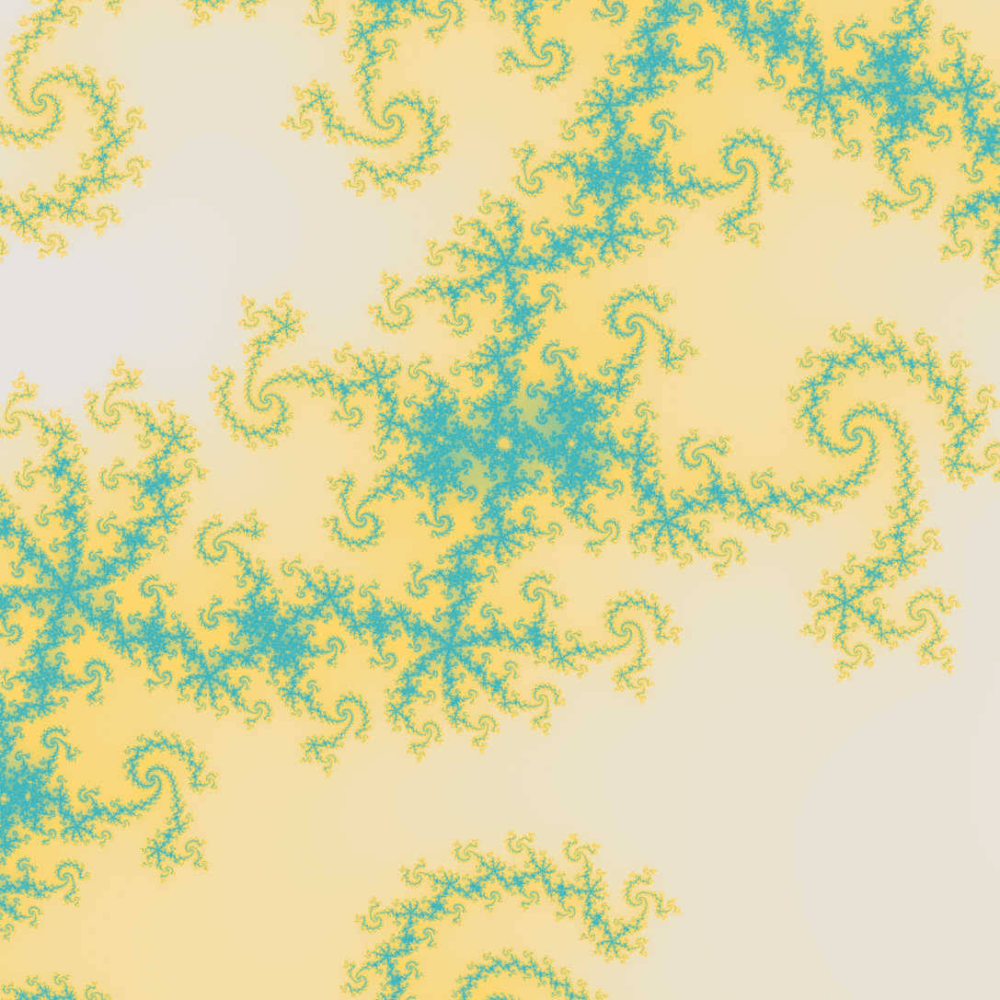

# Mandelbrot Set Collection

Mandelbrot Set Collection是 Mandelbrot 的精选点，使用数值算法生成并刻入 1978 年独特的 NFT 。每幅作品都代表我们最喜欢的分形点之一的邻域，具有随机缩放因子，并根据点发散到无穷大之前函数 f(z) = z^2 + c 的迭代次数以任意梯度着色.

并非所有属性都具有相同的可能性，因此会导致每件艺术品的稀缺程度不同。特别是，更高的缩放级别是有限的，金色点非常稀缺。归因是随机的，因此我们祝您好运，揭开最不寻常的作品之一的面纱。

