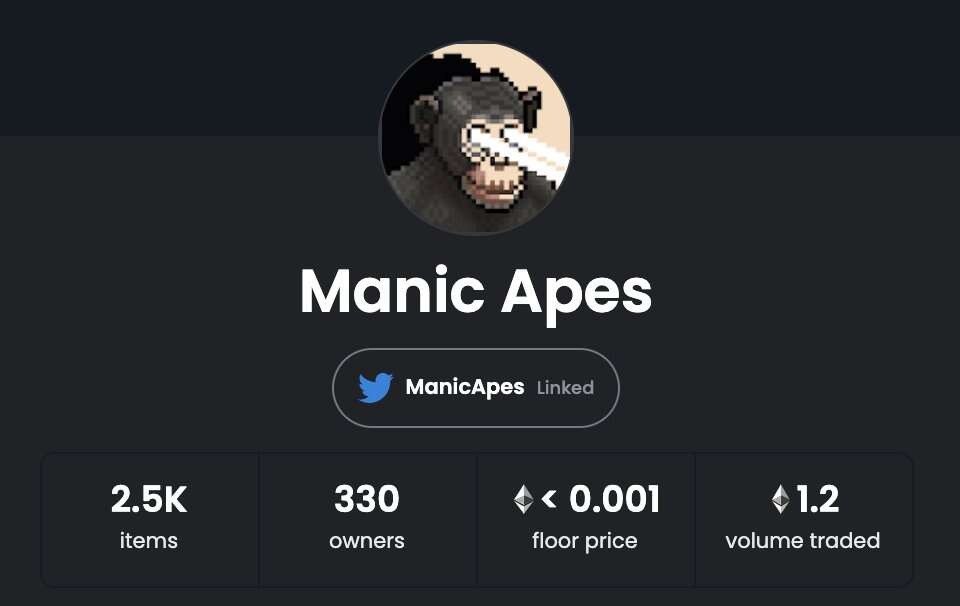

# Manic Apes

Manic Apes 是一个 2500 像素的猿类的集合，他们从圈养中逃到了区块链上，他们正在疯狂。该系列包括许多独特的组合，还有一些 1/1 猿。随着未来计划质押和赚取我们的 $NANAS 代币的计划即将推出，持有者可以在数字和实物奖励上进行互动、赚取和消费。

▶ 什么是狂猿？
Manic Apes 是一个 NFT（不可替代令牌）集合。存储在区块链上的数字艺术品集合。
▶ 存在多少 Manic Apes 代币？
总共有 513 个 Manic Apes NFT。目前 4 位所有者的钱包中至少有一个 Manic Apes NTF。
▶ 最近卖了多少狂猿？
过去 30 天内共售出 0 个 Manic Apes NFT。

