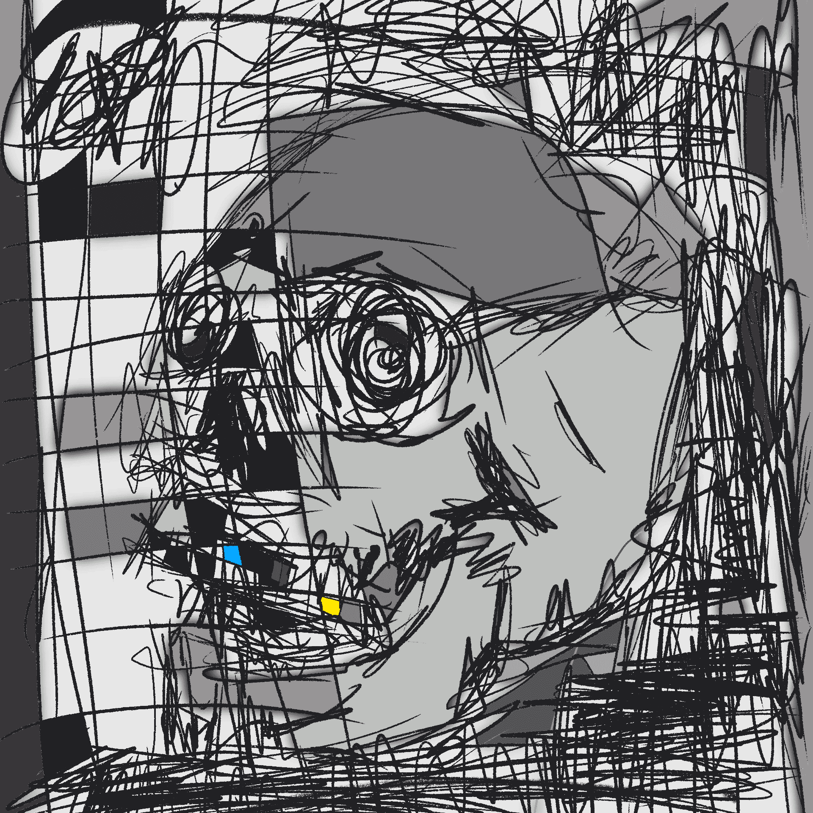

# MANIC24

在 22 年 6 月 11 日加密货币崩盘后，接下来的日子在我们的社区中一片黑暗。我思考了我为什么离开 web2 并提醒自己为什么我在 web3 以及艺术对我和其他人的帮助有多大。所以我决定主持一个 24 小时的 Twitter 空间，在那里我会连续 24 小时每小时画一个新的作品。我知道这听起来很疯狂，但我们需要的是疯狂，艺术家和朋友的流动和公共意识的突然转变。24 小时后快进，我创作了 24 件作品来纪念 2022 年 6 月的加密货币崩盘。这是一种狂野的体验，艺术家、朋友和收藏家一起振奋并独立创作。这是一个我永远不会忘记的时刻，将来可能会再做一次。

