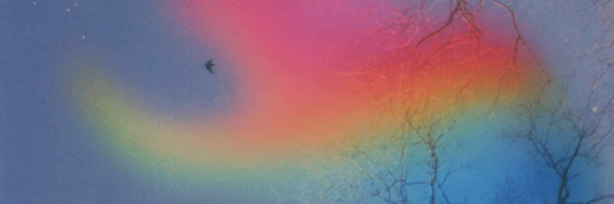

# Manifestation Editions

**表现版本统计**
创建于 4 个月前，6 代币供应，10% 费用
过去 7 天内没有售出任何 Manifestation Edition。

表现形式由 QuantumSpirit 视觉艺术家 Jennifer Panepinto 创作。

Manifestation Editions NFT - 常见问题（FAQ）
▶ 什么是 Manifestation Edition？
Manifestation Editions 是一个 NFT（不可替代令牌）集合。 存储在区块链上的数字艺术品集合。
▶ 存在多少 Manifestation Editions 代币？
总共有 6 个 Manifestation Editions NFT。 目前，17 位所有者的钱包中至少有一个 Manifestation Editions NTF。
▶ 最近卖出了多少显化版？
在过去 30 天内售出了 1 个 Manifestation Editions NFT。
▶ 流行的 Manifestation Editions 替代品有哪些？
许多拥有 Manifestation Editions NFT 的用户还拥有三色三部曲版本-艺术家合作、Gummo Land、POSTMEDIUM 和 Tubby Cats。

