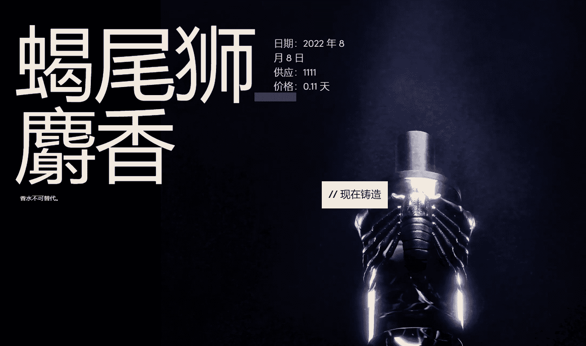

# MANTICORE MUSK

MANTICORE MUSK 是香水品牌 DS & DURGA 与 FVCKRENDER 合作推出的独特系列，提供 IRL 香水的所有权免费声明。实用程序相结合的 genesis/实用程序优先系列。

1924 年，在被毁坏的 Technaós 神殿下的克里特岛多立克发现了一个黏稠油的陶罐，标有 μόσχος μαντικό（翻译：“蝎尾狮麝香”）。据称是这种传说中的野兽的真正分泌物，DS & DURGA使用来自数字宇宙的材料重现了神话般的香气。

香水由音符组成（是的，就像音乐一样）。

