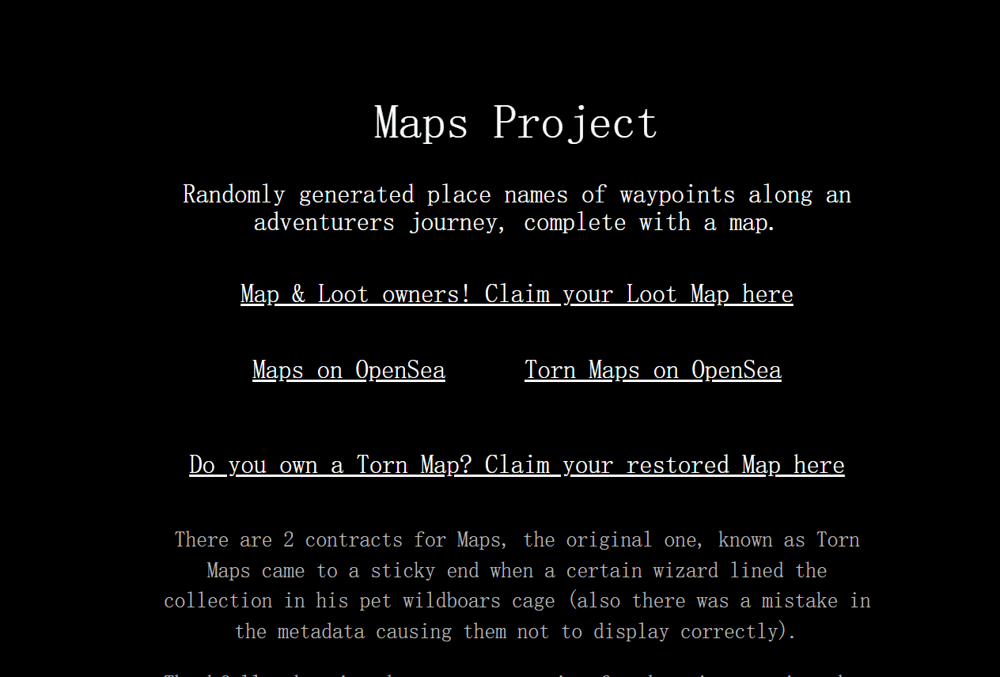

# Maps Project

这些地图是原始[地图项目](https://opensea.io/collection/torn-maps)的恢复版本（固定元数据） 。它们具有与原版完全相同的位置和地图旅程。

地图是冒险家旅程中（伪）随机生成的航路点地名，并附有地图。所有数据都存储在链上。随心所欲地使用地图，并与您最喜欢的冒险战利品配对。较大的 Loot Project 虚拟世界的一部分。

Maps Project 是一个 NFT（Non-fungible token）集合。存储在区块链上的数字艺术品集合。

冒险家旅程中随机生成的航点地名，并附有地图。

地图有 2 份合同，最初的一份被称为“撕裂地图”的合同在某个巫师在他的宠物野猪笼子里排列收藏品时遇到了麻烦（元数据中也有一个错误，导致它们无法正确显示）。

值得庆幸的是，巫师的年轻学徒发现了一个咒语，使地图恢复了原来的荣耀和忠诚。

破损的地图所有者可以随时永久索取他们恢复的地图。

