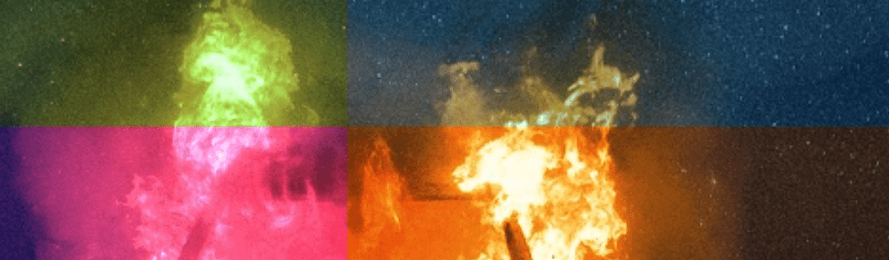

# Marian Hill

Marian Hill NFT 在过去 7 天内售出 4 次。Marian Hill 的总销售额为 532.43 美元。一个 Marian Hill NFT 的平均价格为 133.1 美元。共有 68 位 Marian Hill 所有者，总共拥有 105 个代币。

由 Marian Hill 在 sound.xyz 上创建

Marian Hill NFT - 常见问题（FAQ）
▶ 什么是玛丽安山？
Marian Hill 是一个 NFT（不可替代代币）集合。存储在区块链上的数字艺术品集合。
▶ 玛丽安希尔代币有多少？
总共有 105 个 Marian Hill NFT。目前，68 位车主的钱包中至少有一个 Marian Hill NTF。
▶ 玛丽安希尔最昂贵的拍卖是什么？
售出的最昂贵的 Marian Hill NFT 是 Trippin Out #17。它于 2022-06-21（2 个月前）以 219.6 美元的价格售出。
▶ 最近卖出了多少玛丽安山？
过去 30 天内售出了 10 个 Marian Hill NFT。
▶ 什么是流行的玛丽安希尔替代品？
许多拥有 Marian Hill NFT 的用户还拥有 JON WALTZ、 Siimbiie Lakew、 Sound.xyz和 josh pan上的 Maelstrom 。

