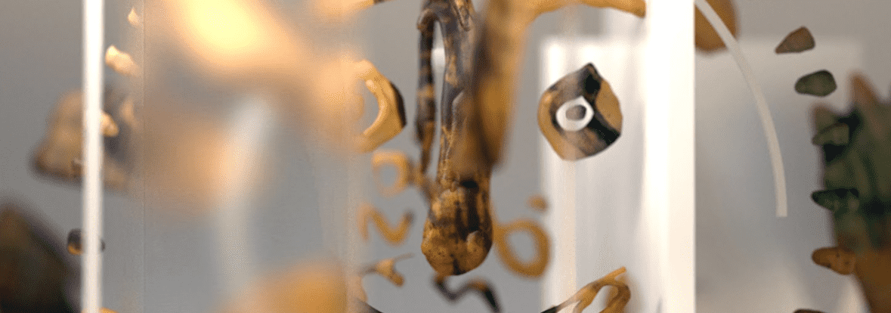

# Marina and Florian Picasso Man and the Beat Visage de couleur

3 个系列：Visage de Demain、Visage de Lumière 和 Visage de Couleur
Marina 和 Florian Picasso Man and The Beat 将在两个不同的日期推出 genesis NFT 系列。

Visage de Couleur 包含 5 种不同的限量版，每款 200 枚，将在www.manandthebeat.com上发布。美国东部时间 2 月 1 日下午 6:30 发布。

Visage de Demain 和 Visage de Lumière 都将于 2 月 3 日在 Nifty Gateway 上发布，拍卖时间为东部时间下午 6:30。这些都将是 24 小时运行的排名拍卖。

Marina and Florian Picasso Man and the Beat Visage de couleur NFT - 常见问题（FAQ）
▶ 什么是 Marina and Florian Picasso Man 和 Beat Visage de couleur？
Marina and Florian Picasso Man and the Beat Visage de couleur 是 NFT（不可替代代币）系列。存储在区块链上的数字艺术品集合。
▶ 有多少 Marina 和 Florian Picasso Man 和 Beat Visage de couleur 代币？
总共有 101 幅 Marina 和 Florian Picasso Man 和 Beat Visage de couleur NFT。目前，45 位车主的钱包里至少有一幅 Marina and Florian Picasso Man 和 Beat Visage de couleur NTF。
▶ 最近卖出了多少 Marina and Florian Picasso Man 和 Beat Visage de couleur？
在过去 30 天内售出了 0 件 Marina 和 Florian Picasso Man 以及 Beat Visage de couleur NFT。

