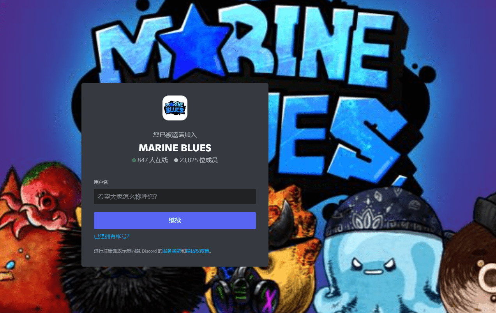

# Marine Blues Reboot Club V2

Marine Blues Reboot Club 是以太坊网络发行的 NFT 项目，共包含 10,000 个 PFP。列出的企业产生的所有利润。

Marine Blues Reboot Club  (MBRC) 是一个基于以太坊的 PFP NFT 项目，它改造了备受喜爱的第一代韩国网络漫画。

Marine Blues Reboot Club 是 10000 NFT 的集合，于 2022 年 7 月 26 日以 0.06 SOL 的价格铸造。当前的底价是 TBA SOL，在过去 24 小时内上涨了 0%。总交易量为 TBA，目前已列出 TBA NFT 的总数。

