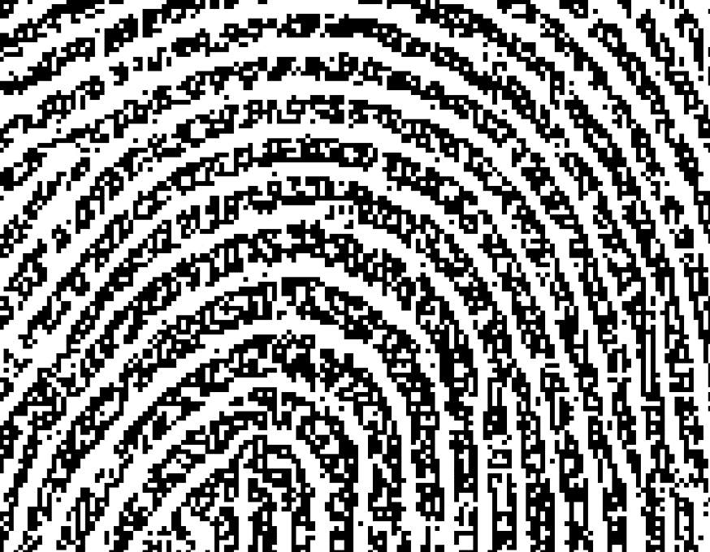

# MARK by Figure31

以共享视觉语言的风格呈现的虚构身份的表现形式。人类标记、指纹，由机器想象，体现在集体记忆中。 MARKS 是 GAN 生成的指纹图像，以区块链艺术美学的共享视觉语言表达：像素化。它们是虚构数字身份的唯一标识符，加上从缩短的常见姓氏列表中生成的名称。一旦它们中的五个被组装起来，它们就可以用来认领一组五个戒指。第二种状态是数字和物理领域之间牢不可破的联系，在艺术家和收藏家之间建立了信任纽带。有关以太坊钱包地址、私钥和域名的信息刻在戒指的内侧。

