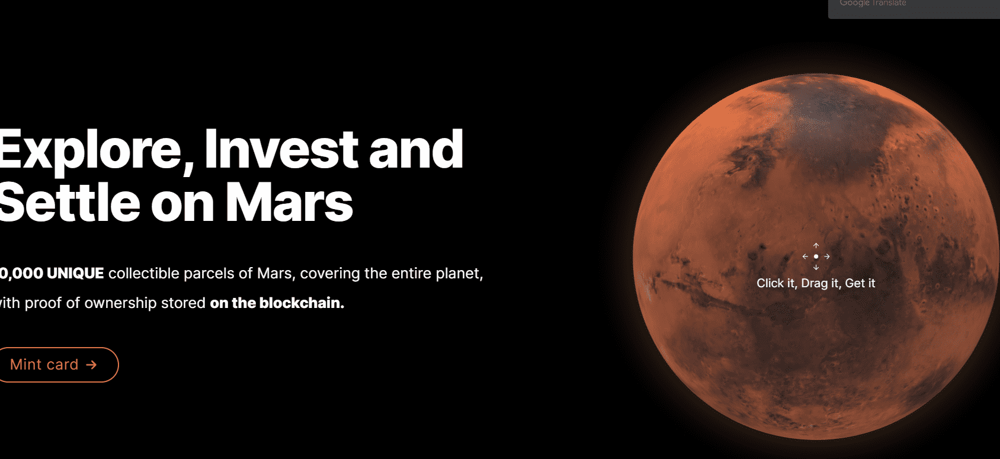

# Mars Genesis

探索投资和定居火星

10,000 个独特的火星收藏包裹，覆盖整个星球，并在以太坊区块链上存储所有权证明。

收集和交易

每张卡片代表一个具有独特坐标的火星。

并非所有地块都具有相同的大小或属性，因此卡片具有不同的值。地形、水数据、温度范围和菌落条件是准确的，并根据最先进的研究编制而成。

Mars Genesis 是一个 NFT（不可替代代币）集合。存储在区块链上的数字艺术品集合。

总共有 2,124 个 Mars Genesis NFT。目前，1,019 位车主的钱包中至少有一个 Mars Genesis NTF。

