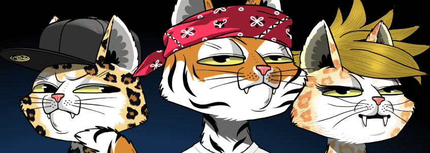

# Mars Alien Cats Collection

Mars Alien Cat NFT 是 ETH 上的独家限量系列，总供应量为 10301，由 Mars Cats Voyage 团队创建。

欢迎来到火星猫之旅
第一个有限的 NFT 集合让持有者能够跟随猫前往火星，最终与外星人会面，扩建他们的殖民地以及沿途的所有发现。

认识外星猫！Mars Alien Cats 系列在为原始 Mars Cats 系列及其火星之旅建立的故事情节中发挥了重要作用。外星人是真正独特的创造物，可以为我们生态系统中的持有者解锁专属效用。它们将被铸造成具有非常有吸引力的稀有形象。拥有一只火星猫，您可以在 MCV 宇宙中获得只有太空团队成员才能获得的独特机会和冒险。

 登陆火星

在我们的 P2E 风格游戏中，我们在航天飞机 Leo 中的航海者们已经通过了迄今为止的每一个挑战和神秘事件。航天飞机已抵达火星，并安全降落在 CASA 转发给团队的坐标处。P2E 风格游戏第一部分中的所有任务都处于暂停状态，而这次新冒险将继续进行（在我们的思维导图 2.0 中进行了概述）。

