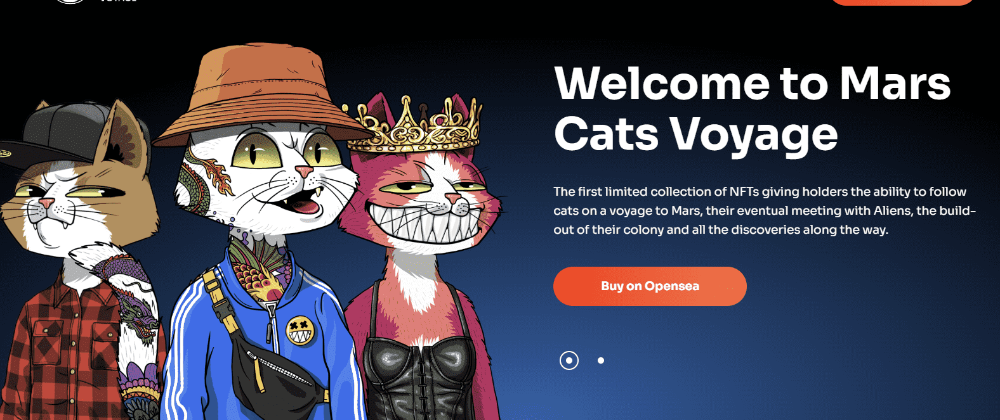

# Mars Cats in Spacesuits

限量 3333 只独特的火星猫穿着他们的个人太空服作为 NFT。主要的 10k [Mars Cats Voyage](https://opensea.io/collection/marscatsvoyage)系列。

认识外星猫

Mars Alien Cats 系列在为原始 Mars Cats 系列及其火星之旅建立的故事情节中发挥了重要作用。外星人是真正独特的创造物，可以为我们生态系统中的持有者解锁专属效用。它们将被铸造成具有非常有吸引力的稀有形象。

第一个有限的 NFT 集合让持有者能够跟随猫前往火星，最终与外星人会面，扩建他们的殖民地以及沿途的所有发现。

我们计划启程前往火星，与外星人取得联系，并在那里建立一个殖民地以继续扩展我们的 MCV 宇宙。我们的 NFT 让您可以访问我们的太空团队将开始的冒险以及沿途的发现。

