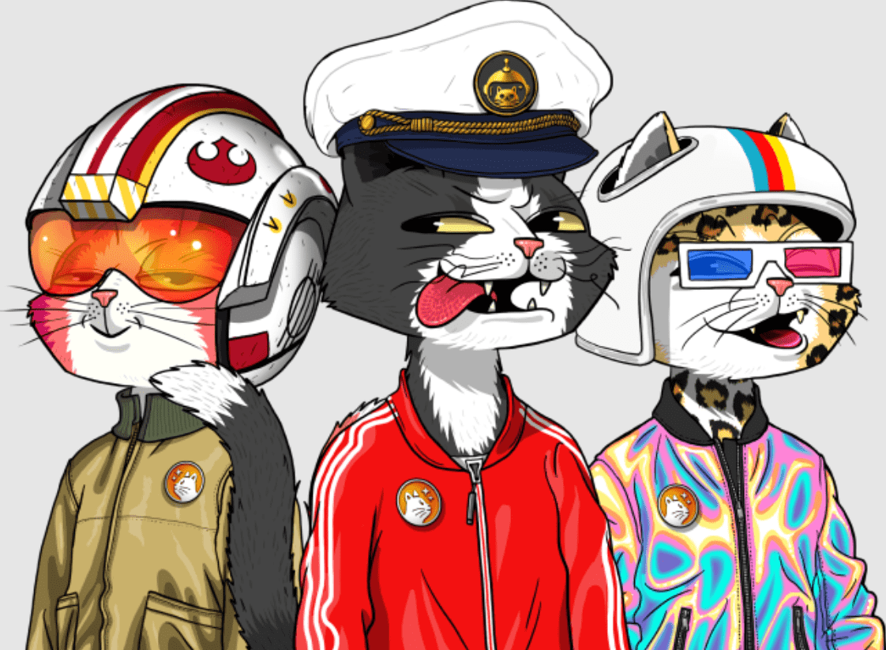

# MarsCatsVoyage

第一个 10000 个独特 NFT 的限量系列，猫正在火星殖民，并让它们的主人有机会成为这次冒险的一部分。

要给您的猫穿上宇航服，请访问我们的宇航服中的[火星猫系列。Mars Cats Voyage 由三个对创新、艺术和 NFT 领域充满热情的朋友创建。我们的 IRL 猫启发了我们推出 MCV。经过几次概念设计后，我们创建了 MCV 系列，并围绕我们的项目聚集了一个庞大的社区。加入！

德鲁船长和迈克是儿时的朋友，他们一起学习艺术。后来他们遇到了 Lesh，并在几个 IT 项目上合作。2021 年，他们深入研究 NFT，讨论了很多想法和概念，并对设计和技术充满热情，他们提出了猫去火星的概念

