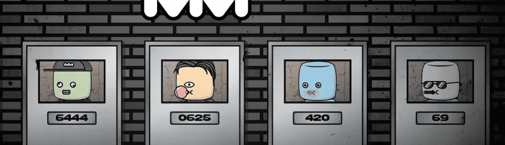

# MarshmallowMob

MarshmallowMob NFT 在过去 7 天内售出 238 次。MarshmallowMob 的总销售额为 2.73 万美元。一份 MarshmallowMob NFT 的平均价格为 11.5 美元。有 497 名 MarshmallowMob 所有者，总共拥有 2,647 个代币。

MarshmallowMob NFT - 常见问题（FAQ）
▶ 什么是 MarshmallowMob？
MarshmallowMob 是一个 NFT（Non-fungible token）集合。存储在区块链上的数字艺术品集合。
▶ 有多少 MarshmallowMob 代币？
总共有 2,647 个 MarshmallowMob NFT。目前，497 位所有者的钱包中至少有一个 MarshmallowMob NTF。
▶ MarshmallowMob 最昂贵的促销活动是什么？
最昂贵的 MarshmallowMob NFT 是 Marshmallow Mob 304。它于 2022 年 6 月 27 日（2 个月前）以 65.9 美元的价格售出。
▶ 最近卖出了多少 MarshmallowMob？
过去 30 天内售出了 840 个 MarshmallowMob NFT。
▶ MarshmallowMob 需要多少钱？
在过去 30 天里，最便宜的 MarshmallowMob NFT 销售额低于 7 美元，最高销售额超过 15 美元。过去 30 天内，MarshmallowMob NFT 的中位价格为 9 美元。
▶ 什么是流行的 MarshmallowMob 替代品？
许多拥有 MarshmallowMob NFT 的用户还拥有 Sasquatch Legends、 The Alien Girl、 Fan Controlled Football: The Ballerz Collective - Gutter Gang和 The Alien Boy。

