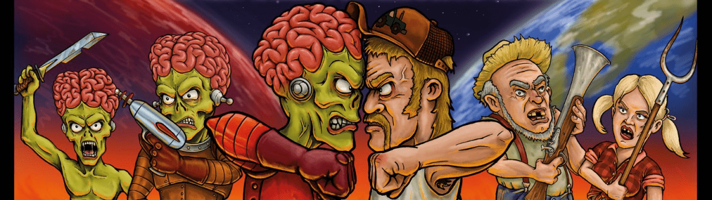

# MvR Limited Bonus Drops (LBD)

这些是限量版奖励掉落物品不要错过，加入我们的火星人大战乡下人 NFT 之旅！加入我们的 Discord https://discord.gg/martiansvs

过去 7 天内未售出任何 MvR 限定红利滴 (LBD)。

MvR Limited Bonus Drops (LBD) NFT - 常见问题 (FAQ)
▶ 什么是 MvR 有限红利下降 (LBD)？
MvR Limited Bonus Drops (LBD) 是一个 NFT（非同质代币）集合。存储在区块链上的数字艺术品集合。
▶ 存在多少 MvR 限制红利 (LBD) 代币？
总共有 2 个 MvR Limited Bonus Drops (LBD) NFT。目前，614 位所有者的钱包中至少有一个 MvR Limited Bonus Drops (LBD) NTF。
▶ 什么是最昂贵的 MvR Limited Bonus Drops (LBD) 销售？
售出的最昂贵的 MvR Limited Bonus Drops (LBD) NFT 是 Redneck Defens Plans。它于 2022-06-16（2 个月前）以 11.8 美元的价格售出。
▶ 最近售出了多少 MvR 限量奖励掉落 (LBD)？
过去 30 天内售出了 1 个 MvR Limited Bonus Drops (LBD) NFT。

德克萨斯之战即将来临

 **3,333**名独特而精美的手绘红脖子将保卫地球。

**3,333**名渴望权力的火星人，一心想要统治银河系。唯一的金色火星人会打破平衡吗？

不要错过，加入我们的火星人大战乡下人 NFT 之旅，使用虚幻引擎！

