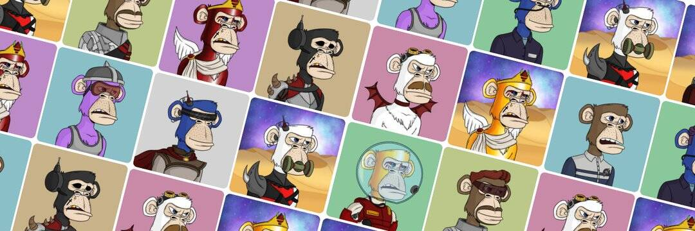

# Martian Ape Starship Club(Official)

我们的故事

2022年初，有一位名叫Ceasar59的科学家。Ceasar59 相信猴子可以成为混乱世界中的和平大使。他开始研究一种可以让他们永远活下去的公式。凯撒努力了多年，直到 2020 年圣诞节前后的一天，他终于找到了解决办法。他简直不敢相信自己的眼睛，一时间以为自己在做梦，但随后意识到这是圣诞节的奇迹。他将他新发现的疫苗应用于 3,333 只猴子，这些猴子是根据它们的智慧和独创性精心挑选出来的。随着时间的推移，他意识到疫苗正在发挥作用，猴子变得越来越年轻和聪明。似乎这个过程发生得太快了，由于地球引力场，猴子正在逆转衰老。

凯撒热切地寻找合适的解决方案，然后才意识到火星将拥有完美的大气层来阻止这一过程。火星将允许猴子成长、发展和殖民这颗红色星球。知道 Elon Musk 已经计划在火星上建立一个殖民地，Caesar 和 Elon 共同努力，以迅速实现这一目标。2022 年，在凯撒和埃隆的合作下，他们能够在最新的 Space X 飞行中将所有猴子发射到火星。这就是火星猿星舰俱乐部的诞生。猴子们迅速开始在这颗红色星球上为自己建造生活和家园。这些猴子甚至比人类同类更年轻、更强壮、更聪明、更创新。

这是火星猿星舰俱乐部的故事和冒险的开始。就像你的 NFT 一样，这些猴子是不朽的和永恒的。只有随着时间的推移而成长、学习和繁荣。他们将共同统治宇宙。

