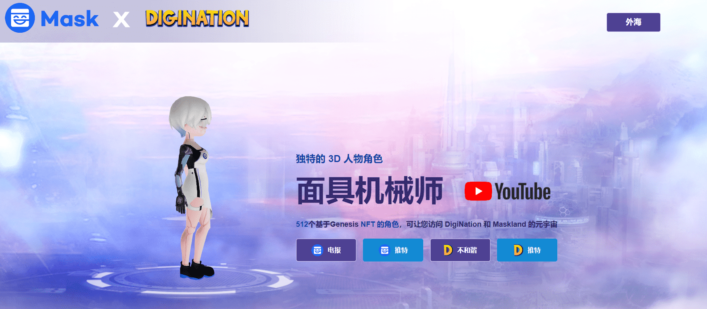

# Mask Machina

由 Mask Network 和 DigiNation 创建的 512 个 Mask Machina 的集合，

它们存在于 Ethereum 区块链上。每个面具机器都是独一无二的，但其中一些是罕见的。

所有 Mask Machina 持有者都可以访问 DigiNation 元宇宙，并从那里扩展，以构建自己的 MaskVerse。

512 Mask Machina 仅在创世纪发布，每个都具有独特的特征和视觉特征。

进入 DigiNation 的元宇宙，探索所有公共游戏和活动，玩游戏并赚钱。

Maskland 的土著居民拥有私人土地并共同建设。

