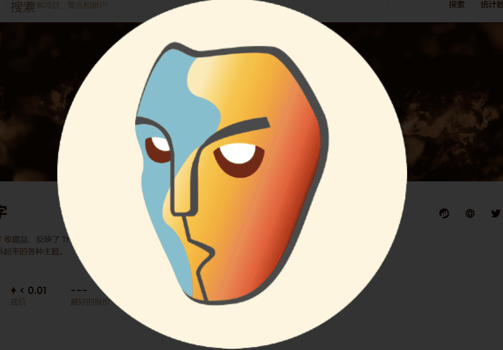

# MaskDAO Word on the Street

Mask Museum Relics 是一系列 NFT 收藏品，反映了 The Hashmasks 社区的热情和创新。将持续委托和创建 New Relic NFT，以突出和促进将人们与艺术联系起来的各种主题。MaskDAO Word on the Street 是一个 NFT（非同质代币）集合。存储在区块链上的数字艺术品集合。Street NFT 上总共有 754 个 MaskDAO Word。目前，554 位所有者的钱包中至少有一个 MaskDAO Word on the Street NTF。

