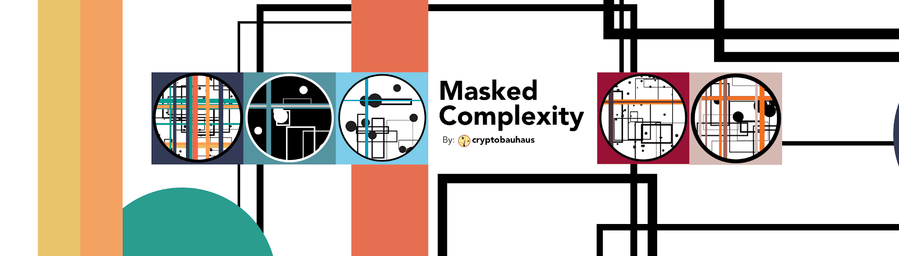

# Masked Complexity

@cryptobauhaus 的有限生成艺术收藏。 总共 200 件面具：从视图中隐藏（某物）复杂性：错综复杂或复杂的状态或质量可能的配色方案：气候、宇宙、城市、经济学、有机体、认知、生态系统、组织

掩蔽的复杂性

面具：从视线中隐藏（某物）

复杂性：复杂或复杂的状态或质量 可能的颜色

计划：气候、宇宙、城市、经济学、有机体、认知、生态系统、组织

掩蔽复杂性 NFT - 常见问题 (FAQ)
▶ 什么是蒙面复杂性？
Masked Complexity 是一个 NFT（不可替代代币）集合。存储在区块链上的数字艺术品集合。
▶ 存在多少 Masked Complexity 代币？
总共有 200 个 Masked Complexity NFT。目前，17 位所有者的钱包中至少有一个 Masked Complexity NTF。
▶ 最近卖出了多少 Masked Complexity？
过去 30 天内售出 0 个 Masked Complexity NFT。

