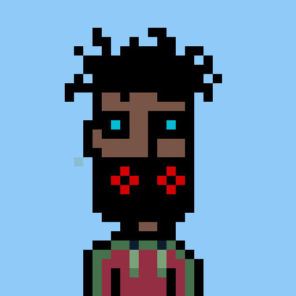

# MaskedWeirdos

MaskedWeirdos 是 Polygon 区块链上 10K 个独特的 NFT +2 个特殊字符的集合。（0% 版税）

5.8K 代币已上架，其余代币即将上市。

这些天最好保持匿名，所以戴上你的面具，选择你最喜欢的MW。

患有多动症的上帝的孤儿。查看*Masked Weirdos* (MAW) 价格、交易和持有人动态图表。在 DEX 上查找 MAW 并检查诈骗。*在币安上运行的蒙面*怪人令牌（硬币）

