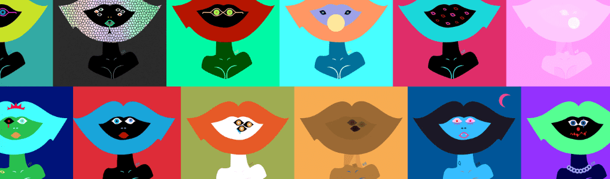

# Maskiss

我是韩国艺术家。 我创作独特而有吸引力的作品。 我邀请你到我的艺术世界。

我将这项工作作为我的第一个 NFT 工作。 感谢您的关注。

他是我这些天正在创作的创意图画书的主角。 我能为俄乌战争做的就是这样工作。

<Clha NFT 1 年>
2021 年 3 月。 认识艺术家和俱乐部。
Okabang 在我们共享 23 页的 PDF 以相互介绍 NFT 时创建。

我们创造了如此多的“作品”，无法一一列举。

NFT 版本中的身份从这里开始。

到目前为止，在收藏的 124 件作品中，有 113 件作品遇到了很好的主人，这些作品目前都可以在我的收藏中购买。本周，我们将列出 5 款新的单线作品，并提供 2 款精品作品。
感谢您的关注。

