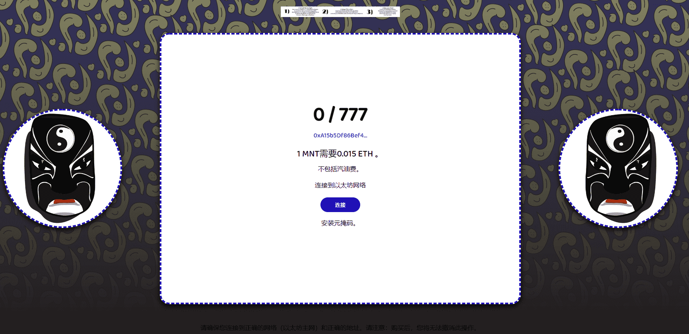

# MaskNet

面具超越了区块链，并试图以不同的特征隐藏自己。如果你想保护自己免受它的睥睨凝视，这就是你现在必须隐藏的方式。

 什么是 MaskNet？

MaskNet 是一个 NFT（Non-fungible token）集合。存储在区块链上的数字艺术品集合。

有多少 MaskNet 代币？

总共有 96 个 MaskNet NFT。目前，15 位所有者的钱包中至少有一个 MaskNet NTF。

最近卖出了多少 MaskNet？

过去 30 天内售出 0 个 MaskNet NFT。

