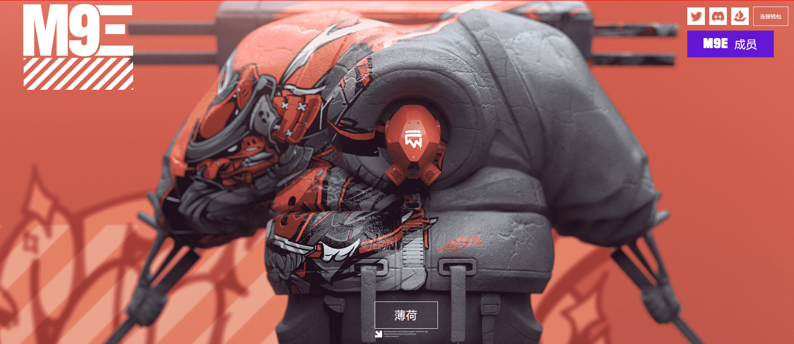

# Master9Eyes

999 个 M9Ξ NFT 的 9 个集合 Master9eyes 是一个收藏项目，它将让长期收藏家的收藏获得奖励。
由Daytoner 创作，他是一位著名的概念艺术家，为 Epic Games、Bungie、Universal 等公司工作！

数字 9 在 Daytoner 宇宙中是一个非常标志性的元素。九在文化上和数学上都是一个惊人且非常独特的数字。从某种意义上说，九是所有数字中最高的，因为之后的一切都只是较低数字的组合。从这个意义上说，它象征着最后的边界。数字空间让我们有机会探索无法物理制造的 M9Ξ 设计，并开辟了销售数字甚至可能受到这些新 M9Ξ 创作启发的实体设计的可能性。

