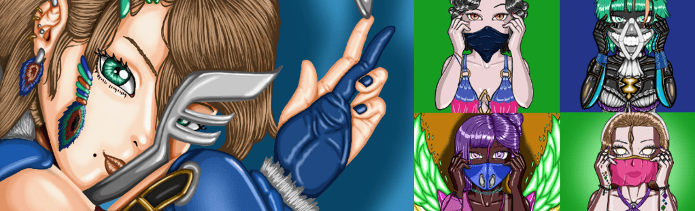

# MasukuGirl

每个人都戴口罩，无论是在社交媒体上、在家里、在学校还是在任何不同的地方。 戴口罩意味着你在保护自己，隐藏自己，为自己感到羞耻，甚至保护他人。 MasukuGirl 是一个 10.000 NFT 动漫风格的集合，其中包含戴着不同类型面具的女孩。 他们为什么要戴口罩？ 你为什么要戴口罩？

MasukuGirl NFT 在过去 7 天内售出 1 次。MasukuGirl 的总销售额为 5.49 美元。一个Masukugirl NFT的平均价格为5.5美元。有 2 个 MasukuGirl 所有者，拥有 100 个代币的总供应量。

Masukugirl NFT-常见问题（常见问题解答）
▶ 什么是增肌少女？
MasukuGirl 是一个 NFT（非同质代币）集合。存储在区块链上的数字艺术品集合。
▶ 有多少 MasukuGirl 代币？
总共有 100 个 MasukuGirl NFT。目前有 2 位所有者的钱包中至少有一个 MasukuGirl NTF。
▶ 最昂贵的 MasukuGirl 促销是什么？
售出的最昂贵的 MasukuGirl NFT 是 MasukuGirl #100。它于 2022-07-02（大约 2 个月前）以 5.5 美元的价格售出。
▶ 最近卖了多少MasukuGirl？
过去 30 天内售出 1 个 MasukuGirl NFT。

