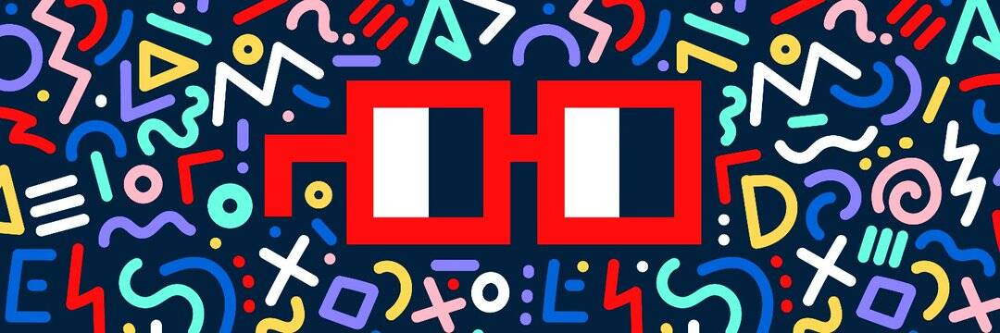

# Material Icons V2

链资产店 Nouns DAO 成员（245），Nouns 艺术节创始人，软件工程师，企业家，投资人，特斯拉公牛  完全链上的 Kamon Symbols NFT，“柏系列”NFT 现在可用于铸币（免费铸币，但您需要支付汽油费才能将矢量数据上传到区块链）。 您将获得 9 个 NFT 和一个薄荷糖。

这是“链资产商店”项目的一部分，该项目是为使区块链上的各种矢量资产提供的努力，并使它们变得可以组合。有关详细信息，请参阅[链资产店和作曲家。

我们正在使用“众筹”的方法，每个铸币者支付少量的 gas 费用来将矢量图像上传到区块链，并获得多个 NFT 作为奖励。

请选择“组”和“类别”，然后单击下面的图像之一。

