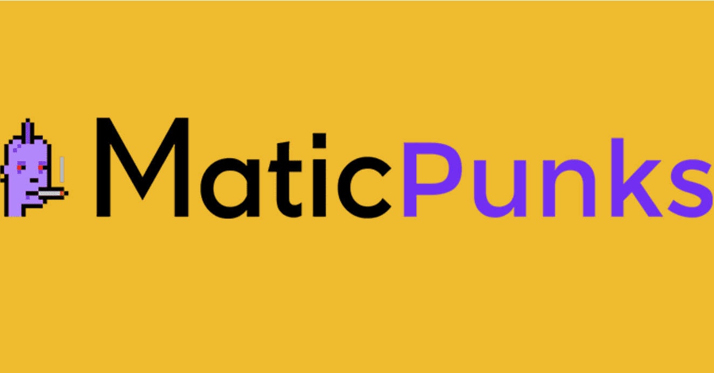

# MaticPunks

MaticPunks 是 Polygon(Matic) 区块链上的 NFT10,000 个独特的 MaticPunk 开放供在 Polygon 区块链上铸造

这 10,000 个 MaticPunk 中的每一个都具有根据定义的稀有系统使它们独一无二的属性。它是区块链上最快的朋克。通过铸造 MaticPunks，您成为 Polygon Network 上第一个朋克 NFT 的骄傲拥有者。当您铸造一个时，您将获得一个独一无二的 MaticPunks，其所有权证据保存在多边形网络上。此项目 (MaticPunks) 不隶属于 LARVA LABS 和/或 CRYPTOPUNKS

本着公平的精神，并为每个人提供获得一个（或多个）MaticPunks 的机会，购买是随机进行的。

MaticPunks 的身份将一直隐藏，直到您的交易完成。没有先到先得，每个人都有机会获得 MaticPunks Zombie 或 MaticPunks Ape。

