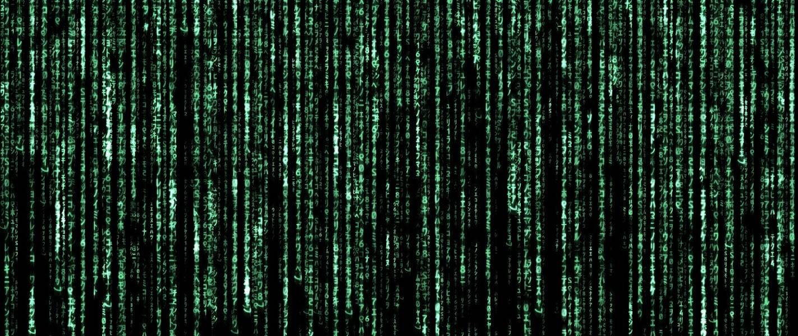

# Matrix 1999

1,999 颗药丸通往不同的道路 | 前华纳兄弟 MatrixDAO 的 3D 艺术品链上项目💰NFT 二次销售所赚取的版税的 50% 将直接存入 DAO 国库，由社区完全管理。

Matrix 1999 NFT - 常见问题（FAQ）
▶ 什么是 Matrix 1999？
Matrix 1999 是一个 NFT（非同质代币）集合。存储在区块链上的数字艺术品集合。
▶ Matrix 1999 代币有多少？
总共有 1,999 个 Matrix 1999 NFT。目前，364 位所有者的钱包中至少有一个 Matrix 1999 NTF。
▶ Matrix 1999 年最昂贵的销售是什么？
Matrix 1999 NFT 售出的最贵的是 #278。它于 2022 年 6 月 17 日（2 个月前）以 0 美元的价格出售。
▶ 最近卖出了多少 Matrix 1999？
过去 30 天内售出了 3 个 Matrix 1999 NFT。
▶ 什么是流行的 Matrix 1999 替代品？
许多拥有Matrix 1999 NFT的用户还拥有 A Familiar Memory Genesis、 Hidden Kreatures、 LanBo NFT和 The Forgotten Cult。

