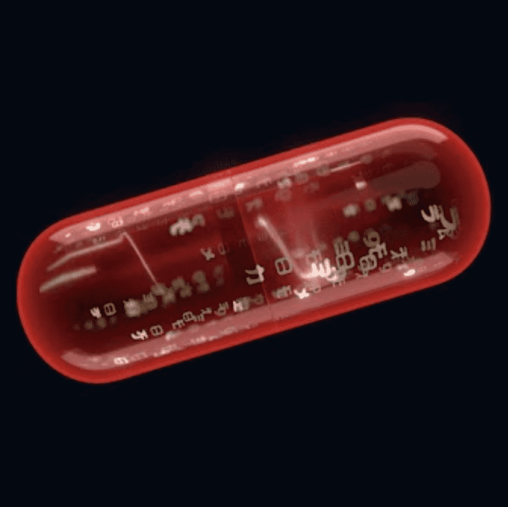

# Matrix 1999

1,999 颗药丸通往不同的道路 | 前华纳兄弟的 3D 艺术品链上项目。MatrixDAO💰NFT 二次销售所赚取的特许权使用费的 50% 将直接存入由社区完全管理的 DAO 国库

MatrixDAO 是一个面向矩阵粉丝、艺术家和 Web3 爱好者的社区，旨在帮助塑造 Matrix 1999 将成为社区拥有的品牌。

▶ 什么是 Matrix 1999？

Matrix 1999 是一个 NFT（非同质代币）集合。存储在区块链上的数字艺术品集合。

▶ Matrix 1999 代币有多少？总共有 1,999 个 Matrix 1999 NFT。目前，364 位所有者的钱包中至少有一个 Matrix 1999 NTF。

▶ Matrix 1999 年最昂贵的销售是什么？

Matrix 1999 NFT 售出的最贵的是 [#278]。它于 2022-06-17（3 个月前）以 0 美元出售。

▶ 最近卖出了多少 Matrix 1999？

过去 30 天内售出了 3 个 Matrix 1999 NFT。

