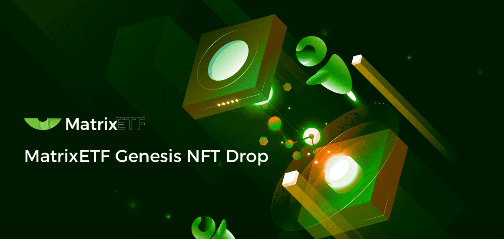

# Matrix Genesis NFT

MatrixETF是下一代运行跨链的去中心化ETF平台，旨在为用户建立去中心化、自动化、个性化、多元化的投资组合，帮助用户轻松享受长期、稳定、高效的金融服务。MatrixNFT 是MatrixETF的NFT集合平台，旨在增加流动性，激励用户参与社区建设，丰富和完善加密市场ETF生态。

什么是MatrixETF？

MatrixETF 构想了一个金融世界，在这个世界中，获取财富是一个被动和自动化的过程。不分地域、不分基础设施，任何人都可以通过互联网发家致富，获得公开透明的投资组合和多种投资策略，快速便捷地参与DeFi金融，获得收益和激励，通过DAO共同确定发展方向社区。
未来属于每一个 MatrixETF 参与者。

